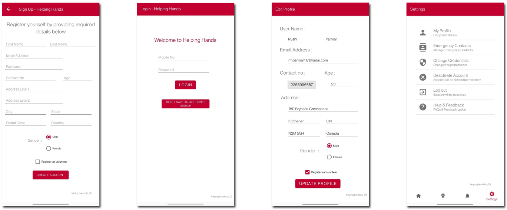
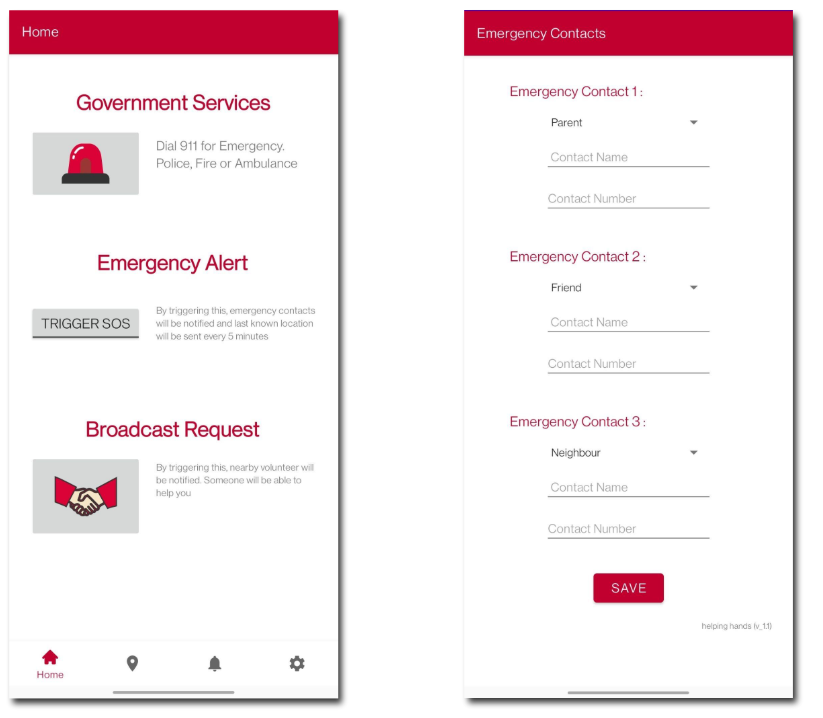
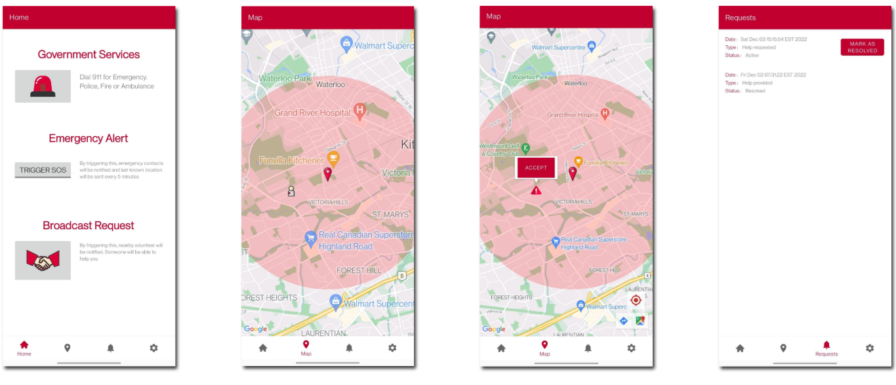

# Helping Hands: Emergency Help and Safety System

Helping Hands is an Android application developed to enhance personal safety and emergency response by connecting users with nearby volunteers and emergency services.

---

## Table of Contents

1. [Abstract](#abstract)
2. [Introduction](#introduction)
3. [Features](#features)
4. [Screenshots](#screenshots)
5. [Technologies Used](#technologies-used)
6. [Software Requirements Specification](#software-requirements-specification)
7. [Use-case Diagram](#use-case-diagram)
8. [Testing](#testing)
9. [Limitations and Future Extensions](#limitations-and-future-extensions)
10. [Conclusion](#conclusion)
11. [Bibliography](#bibliography)

---

## Abstract

Modern societies face increasing safety concerns, necessitating robust emergency response systems. Helping Hands addresses this need with an Android application that facilitates quick access to emergency services and nearby volunteers during crises.

---

## Introduction

The prevalence of crime and unforeseen emergencies underscores the need for solutions that ensure personal safety, especially for individuals living independently or away from immediate support networks. Helping Hands aims to mitigate these challenges by providing a platform where users can swiftly seek assistance from both emergency services and volunteers within their vicinity.

---

## Features

### 1. Emergency Contacts

- **Government Services**: Direct access to emergency services such as police, medical, and fire departments.
- **SOS Alert**: Activate an SOS alert to notify selected contacts with live location updates every 50 seconds.

### 2. Volunteer Connectivity

- **Find Nearby Volunteers**: Users can view and contact nearby volunteers willing to provide assistance during emergencies.
- **Broadcast Help Requests**: Initiate emergency broadcasts to notify nearby volunteers who can respond to urgent requests.

### 3. User Account Management

- **Profile Management**: Users can create, update, and deactivate their profiles.
- **Emergency Contacts**: Manage and update emergency contact information for quick access during emergencies.

### 4. Geolocation and Mapping

- **Live Location**: Display user's current location on a map.
- **Volunteer Locations**: Show locations of nearby volunteers who are available to help.
- **Emergency Requests**: Display locations of other users requesting help nearby.

### 5. Emergency Broadcasts

- **Critical and Intermediate Levels**: Users can broadcast emergency signals based on the severity of the situation, notifying nearby volunteers and selected emergency contacts.

---

## Technologies Used

- **Android Studio**: Integrated development environment (IDE) for Android app development.
- **Cloud Firestore**: Flexible, scalable database for storing and syncing data in real-time.
- **Google Maps API Platform**: Provides dynamic maps, geolocation data, and route planning.
- **Java**: Primary programming language for Android app development.
- **XML**: Markup language used for designing user interface layouts in Android.

---

## Software Requirements Specification

### Managing User Profile

- **Create User Profile**: Register users with basic personal details.
- **Update User Profile**: Allow users to modify their profile information.
- **Deactivate User Profile**: Provide an option for users to deactivate their profiles.
- **View User Profile**: Display user's profile details upon request.

### Geolocation and Mapping

- **Display Current Location**: Show user's live location on an integrated map.
- **Locate Nearby Volunteers**: Fetch and display locations of nearby volunteers.
- **Show Emergency Requests**: Display locations of other users requesting help nearby.

### Emergency Signals and Notifications

- **Generate Emergency Signals**: Allow users to initiate emergency signals.
- **Broadcast Help Signals**: Notify nearby volunteers and emergency contacts about the user's emergency situation.
- **Contact Government Services**: Provide a feature to contact government emergency services directly.

---

## Screenshots

### User Management

### Call and text Emergency Contacts

### Request and Accept Help

---

## Use-case Diagram

The use-case diagram illustrates how users (normal users and volunteers) interact with the system to access emergency services, broadcast requests, manage profiles, and respond to emergency alerts.

---

## Testing

Helping Hands underwent rigorous manual testing, including integration testing and regression testing, to ensure seamless functionality across all modules and reliable system performance.

---

## Limitations and Future Extensions

- **Limitations**: Optimization of background processes and thread management to reduce system load.
- **Future Extensions**: Enhancement of user interface for improved interaction, implementation of more efficient background processes, and expansion of functionalities.

---

## Conclusion

Helping Hands serves as a crucial tool for users to swiftly seek assistance during emergencies, connect with volunteers in their vicinity, and notify emergency services effectively, potentially saving lives and providing timely aid to those in need.

---

## Bibliography

- **Book**: Head First Android Development by David Griffiths and Dawn Griffiths
- **Websites**:
  - [Android Developer Documentation](https://developer.android.com/docs)
  - [TutorialsPoint - Android Studio](https://www.tutorialspoint.com/android/android_studio.htm)
